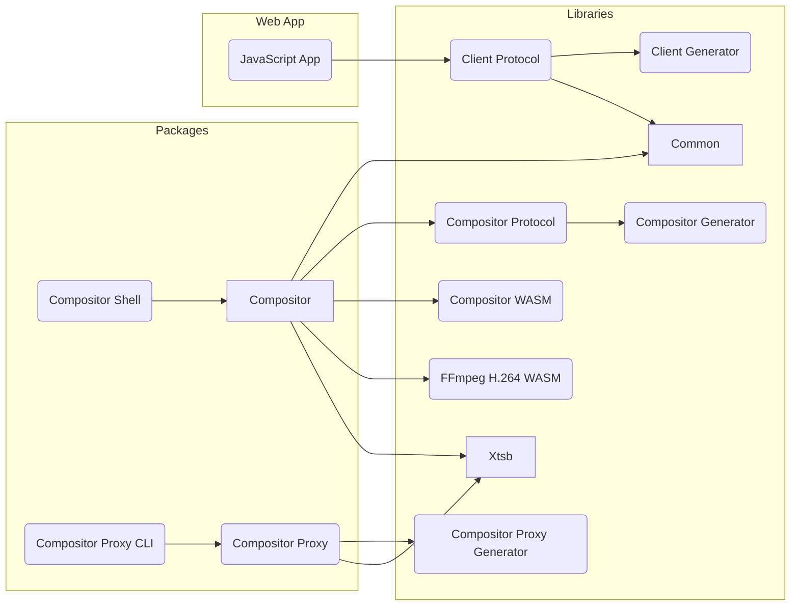

{: .warning }
> **This site documents upstream Greenfield**, the project this repository forked from — its original
> architecture (the browser as Wayland server, WASM apps, the SDK, the compositor-proxy CLI), much of which this fork
> has removed or replaced. This fork is becoming a multi-user remote desktop with server-side compositor sessions and
> a browser viewer; see `ROADMAP.md` in the repository root and the READMEs of `packages/gateway`, `packages/viewer`
> and `packages/compositor`.

